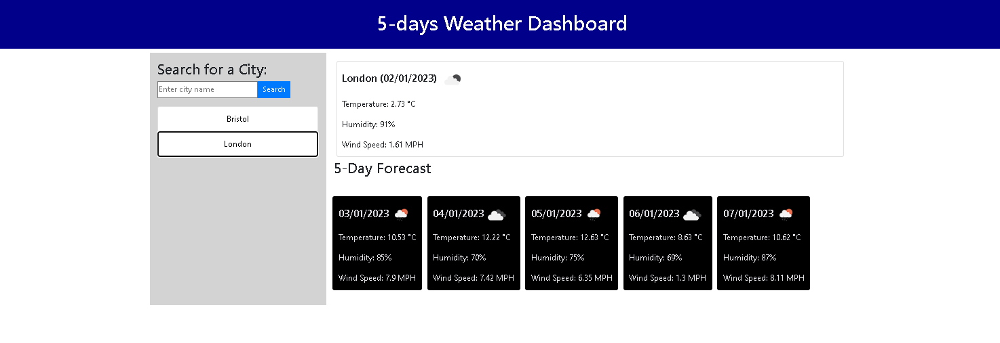

# 5daysWeatherForecast
## Task
create an app that allows users to see the 5 days weather forecast for cities of their choosing.

## Introduction
This personal weather dashboard utilizes the Openweathermap API to grab and display 5 day weather forecast informationsearched cities.

## Technologies Used
* HTML
* CSS
* Javascript
* OpenWeatherMap API
* Bootstrap
* jQuery

## Acceptance Criteria

* Create a weather dashboard with form inputs.
* When a user searches for a city they are presented with current and future conditions for that city and that city is added to the search history.
* When a user views the current weather conditions for that city they are presented with:
  * The city name
  * The date
  * An icon representation of weather conditions
  * The temperature
  * The humidity
  * The wind speed

* When a user views future weather conditions for that city they are presented with a 5*day forecast that displays:
  * The date
  * An icon representation of weather conditions
  * The temperature
  * The humidity

* When a user clicks on a city in the search history they are again presented with current and future conditions for that city.

## Link to live page
https://ansarraja.github.io/5daysWeatherForecast/

## Mock-Up

